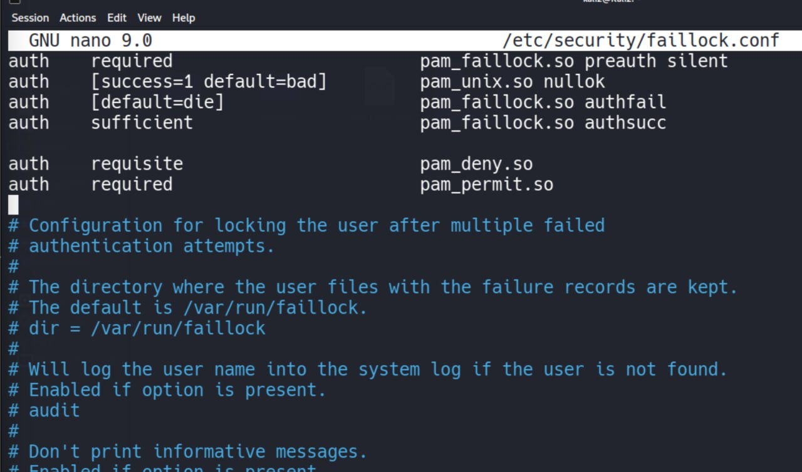
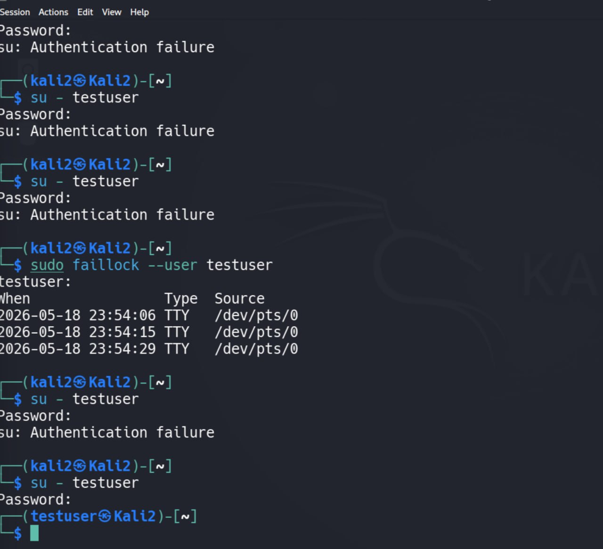

# Linux PAM Hardening and Account Lockout Lab

## Цель работы

В данной лабораторной работе была выполнена настройка базовой защиты Linux-аутентификации через PAM (Pluggable Authentication Modules).

Были изучены:

- создание Linux пользователя;
- password aging policy;
- работа `/etc/shadow`;
- PAM authentication;
- настройка `pam_faillock`;
- защита от brute-force атак;
- account lockout;
- forensic artifacts Linux authentication.

---

# Используемые инструменты

| Инструмент | Назначение |
|---|---|
| PAM | Система Linux-аутентификации |
| pam_faillock | Блокировка после failed login |
| adduser | Создание пользователя |
| chage | Настройка password aging |
| su | Проверка аутентификации |
| faillock | Просмотр failed attempts |
| grep | Проверка конфигураций |
| nano | Редактирование конфигов |
| /etc/shadow | Password hashes и metadata |

---

# Проверка системы

## Проверка release information

Использовалась команда:

```bash
cat /etc/os-release
```

Была получена информация о системе:

- Kali GNU/Linux Rolling
- Version 2026.1
- kali-rolling


---

# Проверка kernel information

Использовалась команда:

```bash
uname -a
```

Был обнаружен Linux kernel:

```text
Linux Kali2 6.19.14+kali-amd64
```


---

# Проверка наличия pam_faillock

Использовалась команда:

```bash
ls /lib/x86_64-linux-gnu/security/ | grep faillock
```

Результат:

```text
pam_faillock.so
```

Это подтвердило наличие PAM-модуля блокировки authentication attempts.


---

# Создание пользователя

Создание пользователя:

```bash
sudo adduser testuser
```

Проверка пользователя:

```bash
id testuser
```

Результат:

```text
uid=1001(testuser)
gid=1001(testuser)
groups=1001(testuser),100(users)
```


---

# Настройка password aging

Для настройки срока действия пароля использовалась команда:

```bash
sudo chage -M 45 testuser
```

Проверка policy:

```bash
sudo chage -l testuser
```

Результат:

- maximum password age = 45 days;
- warning period = 7 days;
- minimum days = 0.


---

# Анализ /etc/shadow

Использовалась команда:

```bash
sudo grep testuser /etc/shadow
```

Был обнаружен password hash пользователя и metadata:

```text
0:45:7
```

Обозначение:

| Значение | Назначение |
|---|---|
| 0 | minimum password age |
| 45 | maximum password age |
| 7 | warning period |


---

# Backup PAM configuration

Перед изменением PAM-конфигурации была создана резервная копия:

```bash
sudo cp /etc/pam.d/common-auth /etc/pam.d/common-auth.bak
```

Проверка backup:

```bash
ls /etc/pam.d/common-auth*
```


---

# Настройка PAM faillock

Редактирование конфигурации:

```bash
sudo nano /etc/pam.d/common-auth
```

Были добавлены строки:

```text
auth required pam_faillock.so preauth silent deny=3 unlock_time=120
auth [default=die] pam_faillock.so authfail deny=3 unlock_time=120
```

Параметры:

| Параметр | Назначение |
|---|---|
| deny=3 | блокировка после 3 ошибок |
| unlock_time=120 | разблокировка через 120 секунд |
| preauth | проверка до authentication |
| authfail | обработка failed login |


---

# Проверка PAM configuration

Использовалась команда:

```bash
grep faillock /etc/pam.d/common-auth
```

Результат подтвердил наличие faillock configuration.


---

# Альтернативная faillock configuration

Использовался файл:

```bash
/etc/security/faillock.conf
```

Проверка configuration:

```bash
sudo grep -v '^#' /etc/security/faillock.conf | sed '/^$/d'
```

Результат:

```text
deny = 3
unlock_time = 120
```

Это означает:

- блокировка после 3 ошибок;
- автоматическая разблокировка через 120 секунд.



---

# Тестирование failed authentication

Для проверки защиты выполнялись неправильные попытки входа:

```bash
su - testuser
```

После ввода неправильного password система возвращала:

```text
Authentication failure
```

После нескольких ошибок PAM начал записывать failed login attempts.


---

# Анализ failed login records

Использовалась команда:

```bash
sudo faillock --user testuser
```

Были обнаружены:

- timestamps;
- TTY source;
- failed authentication attempts.

Это подтверждает работу:

- PAM logging;
- brute-force protection;
- account lockout tracking.


---

# Проверка успешного входа

После reset lockout либо после истечения времени блокировки был выполнен успешный вход:

```bash
su - testuser
```

После ввода правильного password пользователь успешно вошел в систему:

```text
(testuser㉿Kali2)-[~]
```

Это подтверждает:

- корректную работу PAM;
- правильную работу unlock mechanism;
- успешную настройку authentication policy.



---

# Основные forensic artifacts

| Artifact | Location |
|---|---|
| PAM config | `/etc/pam.d/common-auth` |
| faillock config | `/etc/security/faillock.conf` |
| Password hashes | `/etc/shadow` |
| Failed login records | faillock database |
| Authentication logs | `/var/log/auth.log` |

---

# Что было изучено

В ходе лабораторной работы были изучены:

- Linux authentication;
- PAM modules;
- pam_faillock;
- brute-force mitigation;
- password aging;
- Linux user management;
- forensic artifacts;
- failed login analysis;
- account lockout;
- troubleshooting authentication issues.

---

# Вывод

В ходе лабораторной работы была успешно настроена базовая защита Linux-аутентификации через PAM.

Были реализованы:

- password expiration policy;
- failed login monitoring;
- account lockout;
- brute-force mitigation;
- authentication logging.

Также была изучена работа:

- `/etc/shadow`;
- PAM configuration;
- Linux authentication flow;
- forensic artifacts failed authentication attempts.

Практическая работа показала, как Linux может обнаруживать и ограничивать brute-force атаки через PAM и pam_faillock.

---

