# Linux Users, Groups and Shared Directory Management Lab

## Цель работы

В данной лабораторной работе были изучены:

- создание Linux групп;
- создание пользователей;
- управление группами пользователей;
- настройка shared directory;
- изменение владельцев и групп;
- настройка Linux permissions;
- настройка SGID;
- организация совместного доступа к файлам;
- проверка группового наследования;
- практическое управление Linux DAC (Discretionary Access Control).

---

# Используемые команды

| Команда | Назначение |
|---|---|
| groupadd | Создание группы |
| adduser | Создание пользователя |
| usermod | Добавление пользователя в группу |
| groups | Проверка групп пользователя |
| mkdir | Создание директории |
| chown | Изменение владельца/группы |
| chmod | Изменение permissions |
| ls -ld | Просмотр прав директории |
| touch | Создание файла |
| cat | Просмотр содержимого файла |
| echo | Добавление текста в файл |
| su | Переключение между пользователями |

---

# Создание группы projectgroup

Сначала была создана новая Linux группа `projectgroup`.

```bash
sudo groupadd projectgroup
```

После этого была выполнена проверка существования группы:

```bash
getent group projectgroup
```

Результат показал:
- имя группы;
- GID группы;
- успешное создание группы.

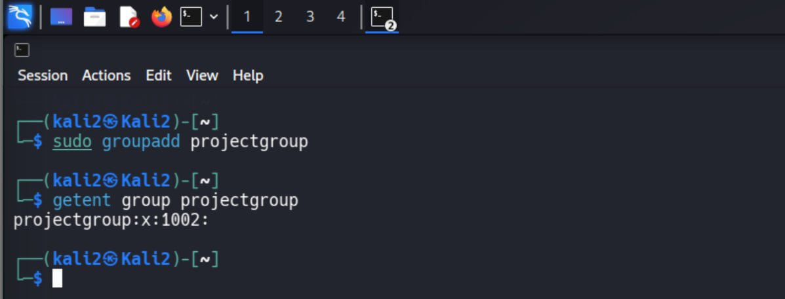

---

# Создание пользователей analyst1 и analyst2

Были созданы два новых пользователя:

```bash
sudo adduser analyst1
sudo adduser analyst2
```

Во время создания:
- задавался пароль;
- создавался home directory;
- создавалась primary group пользователя.

Создание пользователя analyst1:

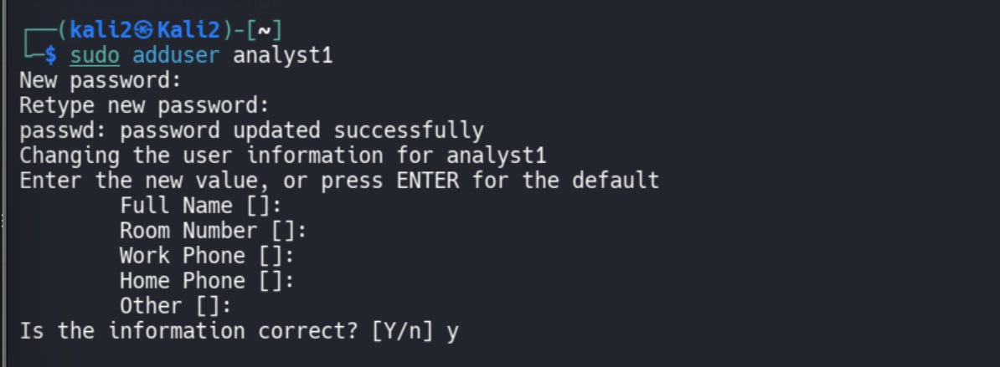

Создание пользователя analyst2:

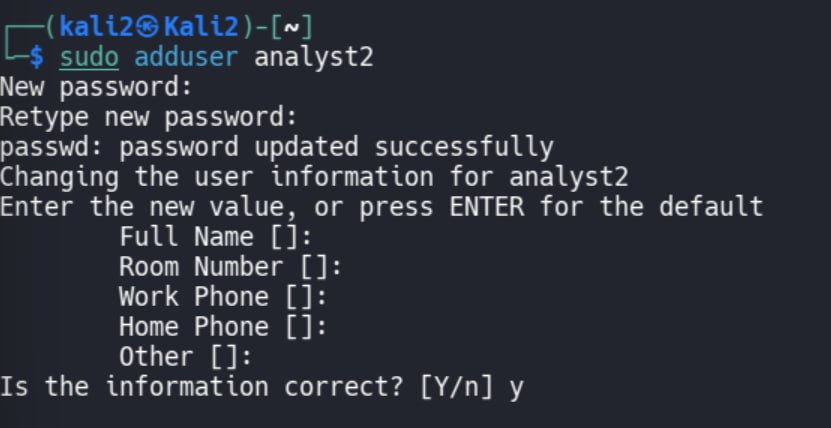

---

# Проверка UID и GID пользователей

Для проверки информации о пользователях использовалась команда:

```bash
id analyst1
id analyst2
```

Результат показал:
- UID пользователя;
- GID пользователя;
- membership groups.

Проверка analyst1:

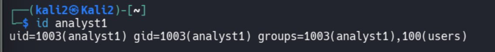

Проверка analyst2:

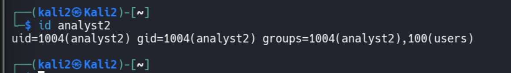

---

# Добавление пользователей в projectgroup

Пользователи были добавлены в shared group:

```bash
sudo usermod -aG projectgroup analyst1
sudo usermod -aG projectgroup analyst2
```

Ключ `-aG`:
- `-G` → secondary groups;
- `-a` → append without removing existing groups.

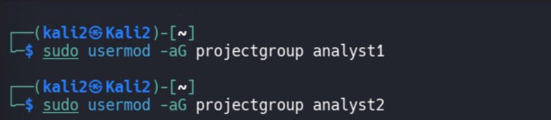

---

# Проверка membership groups

После добавления была выполнена проверка:

```bash
groups analyst1
groups analyst2
```

Результат подтвердил:
- оба пользователя входят в `projectgroup`.

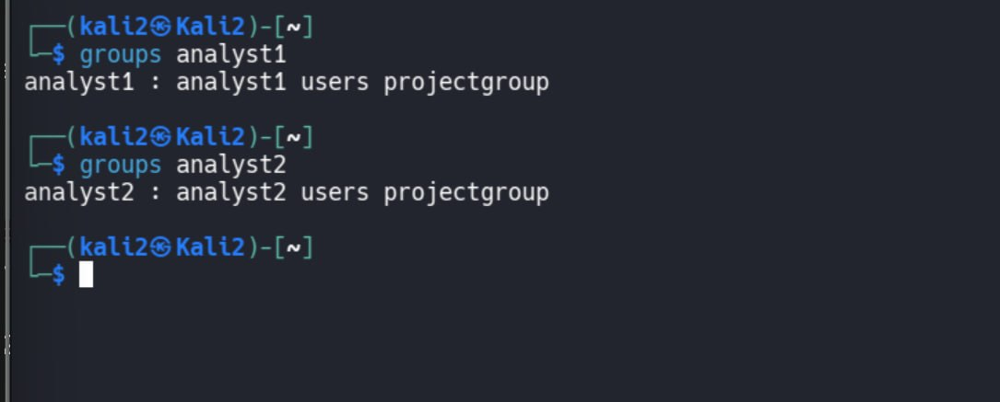

---

# Создание shared directory

Была создана директория для совместной работы пользователей:

```bash
sudo mkdir /sharedproject
```

После этого была проверена inode information:

```bash
ls -id /sharedproject
```

И проверены permissions директории:

```bash
ls -ld /sharedproject
```

Результат показал:
- владельцем является root;
- группой является root;
- стандартные Linux permissions.

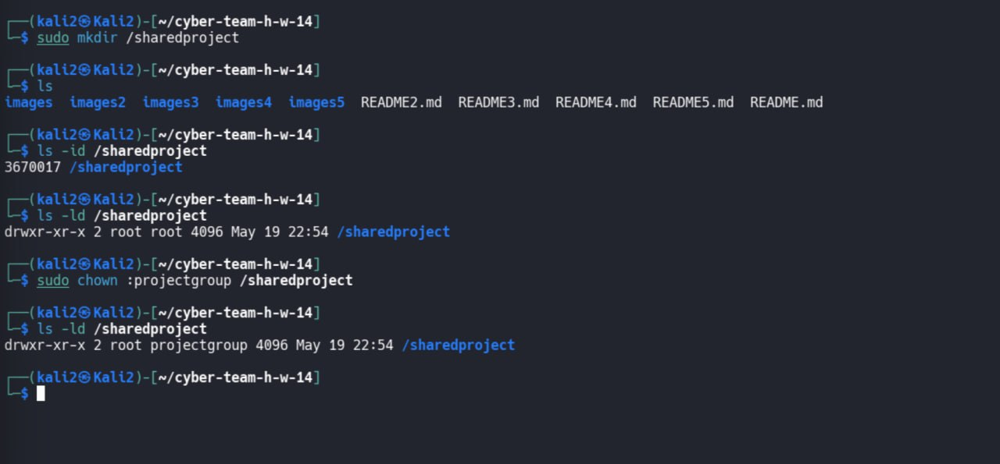

---

# Изменение владельца группы директории

Для организации shared access группа директории была изменена:

```bash
sudo chown :projectgroup /sharedproject
```

После этого была выполнена повторная проверка:

```bash
ls -ld /sharedproject
```

Результат показал:
- group owner изменился на `projectgroup`.

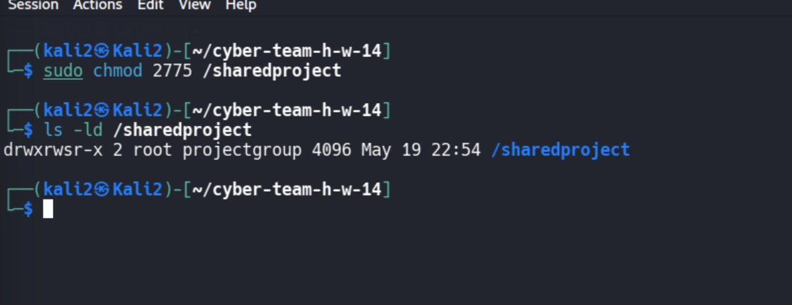

---

# Настройка SGID permissions

Для автоматического наследования группы была настроена SGID bit permission:

```bash
sudo chmod 2775 /sharedproject
```

После этого снова была выполнена проверка:

```bash
ls -ld /sharedproject
```

Результат:

```text
drwxrwsr-x
```

Символ `s` означает:
- SGID active;
- новые файлы будут наследовать group owner директории.

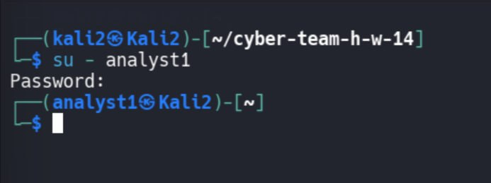

---

# Переключение на analyst1

Было выполнено переключение пользователя:

```bash
su - analyst1
```

Это подтвердило:
- пользователь существует;
- authentication работает корректно.

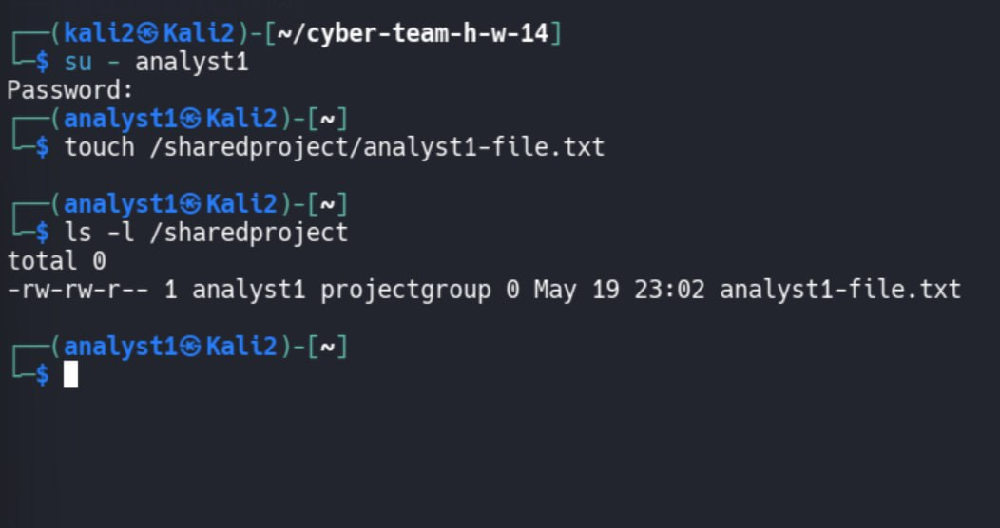

---

# Создание файла analyst1

Пользователь analyst1 создал файл внутри shared directory:

```bash
touch /sharedproject/analyst1-file.txt
```

После этого была выполнена проверка:

```bash
ls -l /sharedproject
```

Результат показал:
- файл принадлежит analyst1;
- group owner автоматически унаследован как `projectgroup`.

Это произошло благодаря SGID.

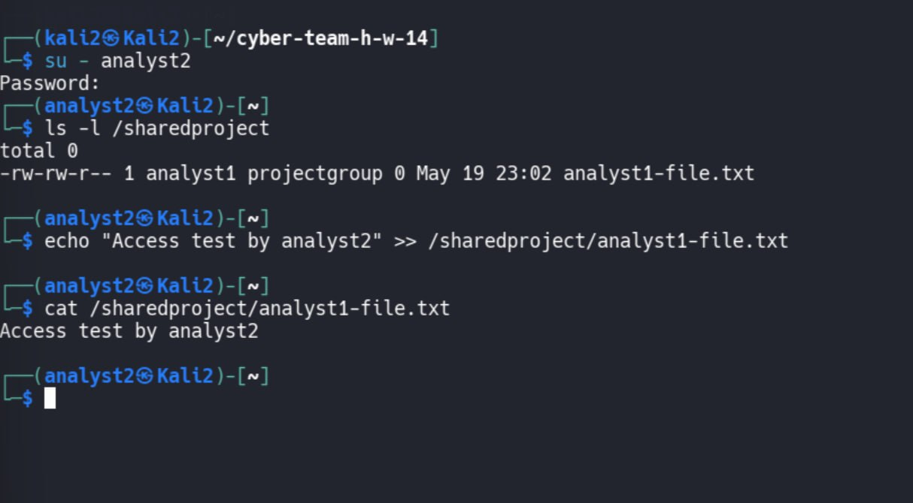

---

# Проверка совместного доступа analyst2

После этого был выполнен вход под analyst2:

```bash
su - analyst2
```

Пользователь analyst2 просмотрел файл:

```bash
ls -l /sharedproject
```

Далее analyst2 добавил текст в файл analyst1:

```bash
echo "Access test by analyst2" >> /sharedproject/analyst1-file.txt
```

Проверка содержимого:

```bash
cat /sharedproject/analyst1-file.txt
```

Результат подтвердил:
- analyst2 имеет write access;
- shared permissions работают корректно;
- group collaboration настроен успешно.


---

# Что было изучено

В ходе лабораторной работы были изучены:

- Linux user management;
- Linux group management;
- DAC permissions;
- SGID inheritance;
- collaborative file access;
- shared directories;
- Linux ownership model;
- permission verification;
- group-based access control.

---
