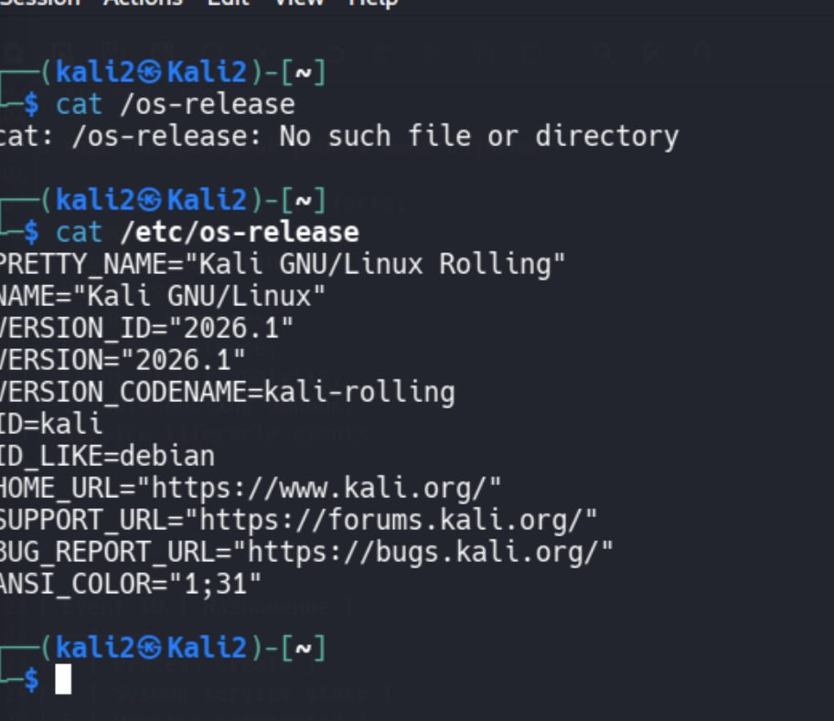
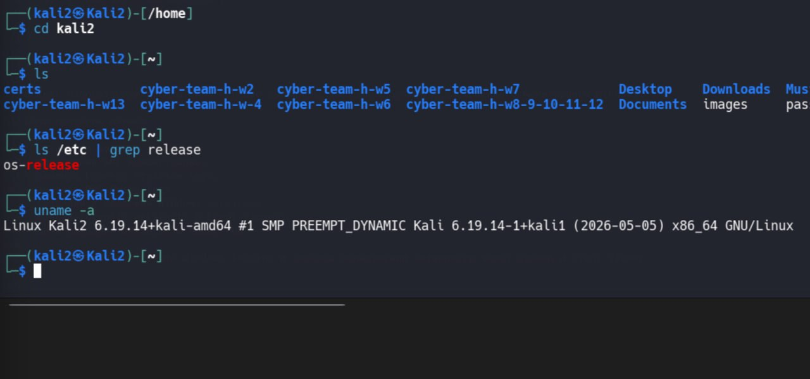
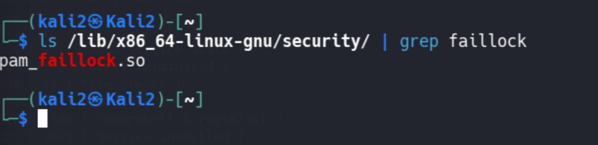
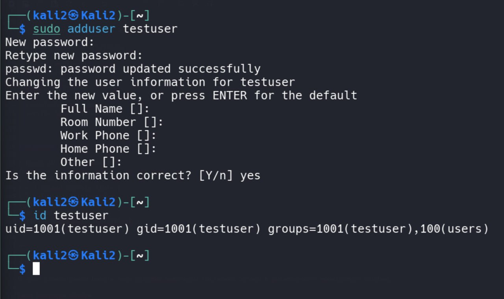
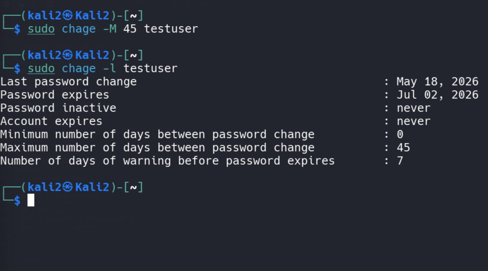
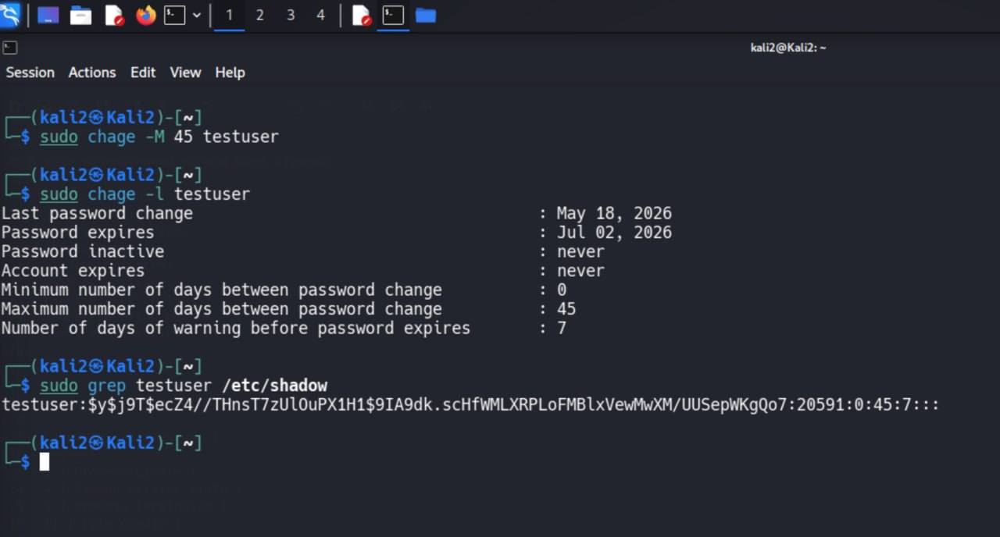
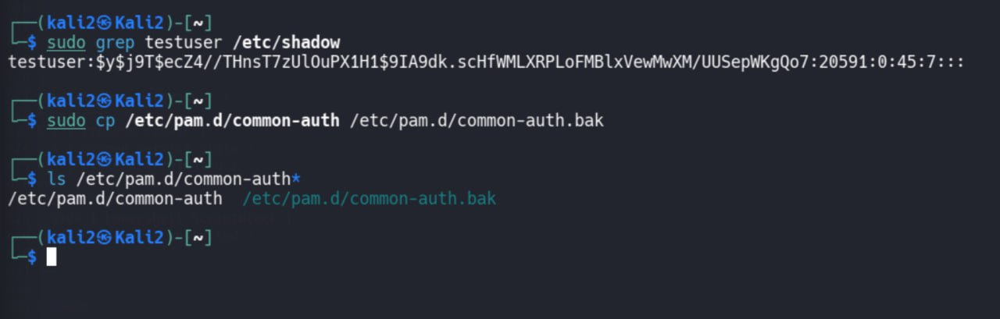
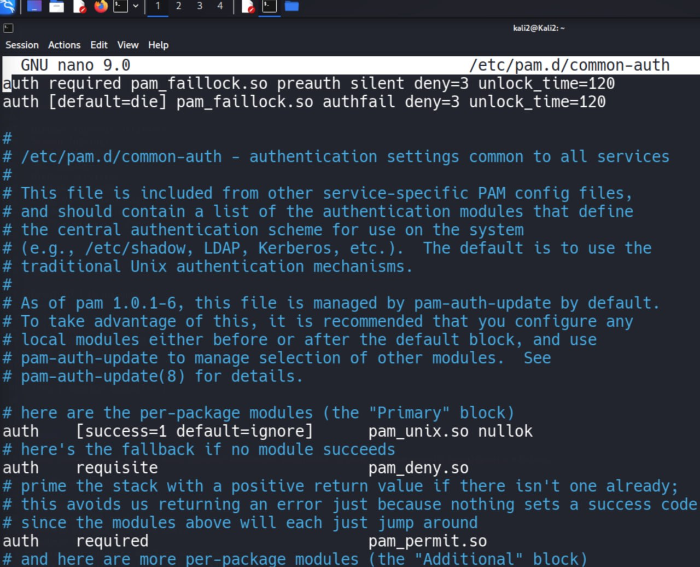
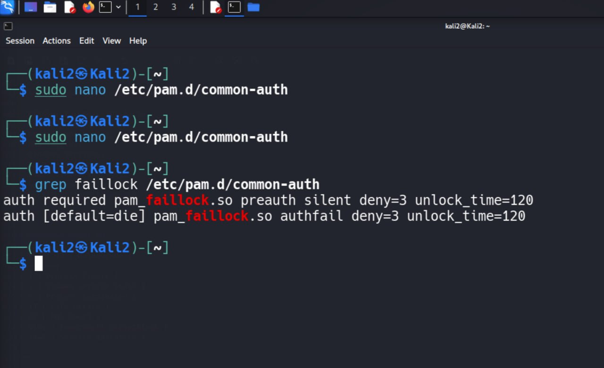

# AppArmor MAC Lab

## Цель работы

В этой лабораторной работе была выполнена настройка AppArmor и создание собственного профиля безопасности для Bash-скрипта.

В ходе работы были изучены:

- проверка статуса AppArmor;
- включение AppArmor через systemd;
- создание тестового Bash-скрипта;
- создание AppArmor profile;
- ограничение доступа к `/etc/shadow`;
- блокировка записи в директорию `/restricted`;
- анализ AppArmor security logs через `dmesg`.

---

# Что такое AppArmor

AppArmor — это Linux Security Module (LSM).

LSM = Linux Security Module.

AppArmor реализует Mandatory Access Control (MAC).

MAC = Mandatory Access Control.

В отличие от обычных Linux permissions (DAC — Discretionary Access Control), AppArmor может ограничивать процессы даже если они запускаются через `sudo` или от root.

AppArmor работает через security profiles.

Каждый profile определяет:

- какие файлы можно читать;
- какие файлы можно писать;
- какие бинарники можно запускать;
- какие действия запрещены.

---

# Проверка состояния AppArmor

Сначала была выполнена проверка состояния AppArmor.

Использованные команды:

```bash
sudo aa-status
systemctl status apparmor --no-pager
```

Что делает `aa-status`:

- показывает загружен ли модуль AppArmor;
- показывает profiles;
- показывает enforce mode;
- показывает complain mode.

Что делает `systemctl status`:

- показывает состояние systemd service;
- active/inactive;
- enabled/disabled.

Результат показал:

- AppArmor module loaded;
- profile loaded;
- service inactive (dead).

Это означает, что AppArmor установлен, но systemd service ещё не запущен.



---

# Включение и запуск AppArmor

Далее AppArmor был включён и запущен.

Использованные команды:

```bash
sudo systemctl enable apparmor
sudo systemctl start apparmor
systemctl status apparmor --no-pager
```

Что делает `enable`:

- добавляет service в автозагрузку systemd.

Что делает `start`:

- запускает сервис прямо сейчас.

После запуска статус изменился на:

```text
active (exited)
enabled
```

Это означает:

- service успешно работает;
- AppArmor profiles загружаются автоматически.



---

# Создание тестового скрипта

Далее была создана тестовая среда.

Создание директории:

```bash
sudo mkdir -p /opt/apparmor-test
```

Создание Bash-скрипта:

```bash
sudo nano /opt/apparmor-test/testscript.sh
```

Выдача execute permissions:

```bash
sudo chmod +x /opt/apparmor-test/testscript.sh
```

Создание restricted directory:

```bash
sudo mkdir /restricted
```

Содержимое скрипта:

```bash
#!/bin/bash

echo "=== Reading /etc/shadow ==="
cat /etc/shadow

echo "=== Writing test file ==="
echo "AppArmor test" > /restricted/test.txt

echo "=== Finished ==="
```

Что делает скрипт:

1. пытается прочитать `/etc/shadow`;
2. пытается записать файл в `/restricted`;
3. выводит результат.

`/etc/shadow` содержит password hashes пользователей Linux и считается sensitive file.



---

# Запуск скрипта ДО AppArmor ограничений

Далее скрипт был запущен без AppArmor profile.

Команда:

```bash
sudo /opt/apparmor-test/testscript.sh
```

Результат:

- `/etc/shadow` успешно прочитан;
- sensitive data доступна;
- запись в `/restricted` разрешена.

Это произошло потому что:

- script запускается через `sudo`;
- Linux DAC permissions разрешают root практически всё;
- AppArmor profile ещё отсутствует.



---

# Создание AppArmor profile

Далее был создан custom AppArmor profile.

Команда:

```bash
sudo nano /etc/apparmor.d/opt.apparmor-test.testscript
```

Содержимое profile:

```text
#include <tunables/global>

/opt/apparmor-test/testscript.sh {

    /opt/apparmor-test/testscript.sh r,
    /bin/bash ix,
    /bin/cat ix,

    /etc/ld.so.cache r,
    /lib/** rm,
    /lib64/** rm,
    /usr/lib/** rm,

    deny /etc/shadow r,
    deny /restricted/** w,

    /** r,
}
```

Разбор profile:

## `deny /etc/shadow r,`

Запрещает:

- чтение `/etc/shadow`.

`r` = read.

## `deny /restricted/** w,`

Запрещает:

- запись в `/restricted`.

`w` = write.

`/**` означает:

- все файлы внутри директории.

## `/bin/bash ix,`

Разрешает запуск Bash.

`ix` = inherit execute.

## `/bin/cat ix,`

Разрешает запуск `cat`.

## `/lib/** rm,`

Разрешает доступ к shared libraries.

Без этого Bash не сможет загрузить system libraries.



---

# Ошибка с shared libraries

После первого запуска profile появилась ошибка:

```text
libtinfo.so.6: failed to map segment from shared object
```

Причина:

AppArmor profile не разрешал memory mapping (`m`) shared libraries.

Для исправления были изменены правила:

```text
/lib/** rm,
/lib64/** rm,
/usr/lib/** rm,
```

`m` = memory map.

После этого Bash смог нормально запускаться.



---

# Загрузка AppArmor profile

Далее profile был загружен через AppArmor parser.

Команда:

```bash
sudo apparmor_parser -r /etc/apparmor.d/opt.apparmor-test.testscript
```

Проверка profile:

```bash
sudo aa-status | grep testscript
```

Результат показал:

```text
/opt/apparmor-test/testscript.sh
```

Это означает:

- profile успешно загружен;
- AppArmor контролирует script.



---

# Проверка работы ограничений

После загрузки profile script был запущен снова.

Команда:

```bash
sudo /opt/apparmor-test/testscript.sh
```

Результат:

```text
Permission denied
```

AppArmor заблокировал:

- чтение `/etc/shadow`;
- запись в `/restricted/test.txt`.

Даже несмотря на запуск через `sudo`.

Это главный смысл Mandatory Access Control.



---

# Анализ AppArmor logs

Далее были просмотрены kernel security logs.

Команда:

```bash
sudo dmesg | tail -20
```

В логах появились записи:

```text
apparmor="DENIED"
```

Также были видны:

```text
operation="exec"
operation="open"
operation="file_mmap"
```

И:

```text
name="/usr/bin/cat"
denied_mask="x"
```

Что это означает:

- AppArmor заблокировал запуск `cat`;
- AppArmor заблокировал filesystem operations;
- kernel audit subsystem записал событие.

Это forensic evidence работы MAC security controls.



---

# Что показывает эта лабораторная работа

Эта лабораторная работа показывает:

- разницу между DAC и MAC;
- как AppArmor ограничивает процессы;
- как работают Linux security profiles;
- как анализировать security logs;
- как блокируются sensitive operations даже для root.

---

# Итог

В ходе лабораторной работы:

- был включён AppArmor;
- создан custom AppArmor profile;
- ограничен доступ к sensitive files;
- запрещена запись в restricted directory;
- проанализированы AppArmor DENIED events;
- изучена работа Mandatory Access Control в Linux.

Лабораторная работа успешно продемонстрировала практическое применение AppArmor для hardening Linux systems.
