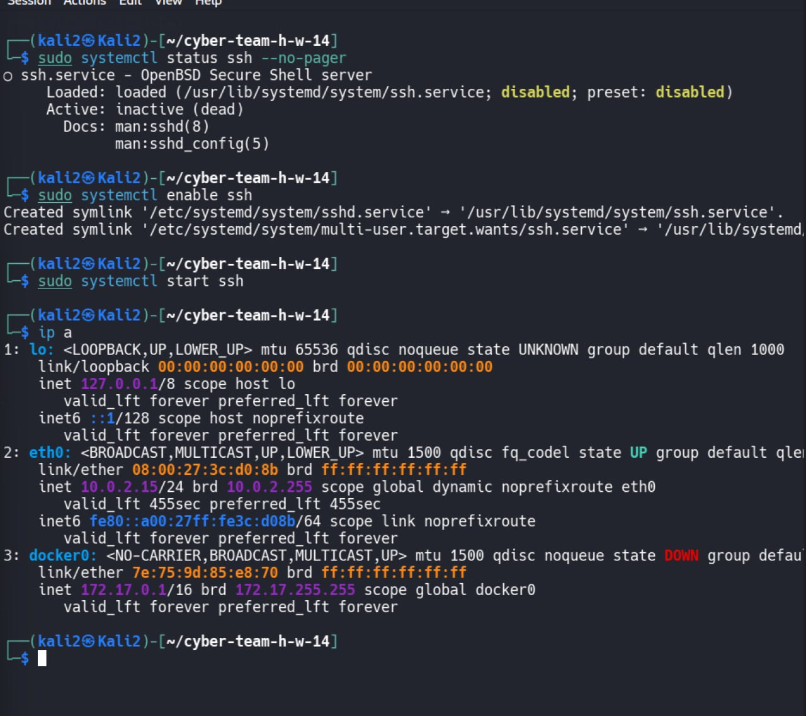
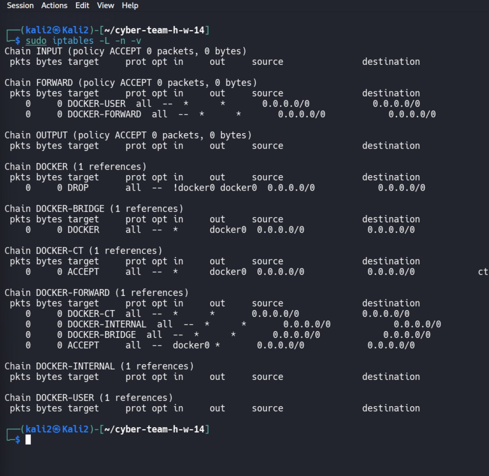
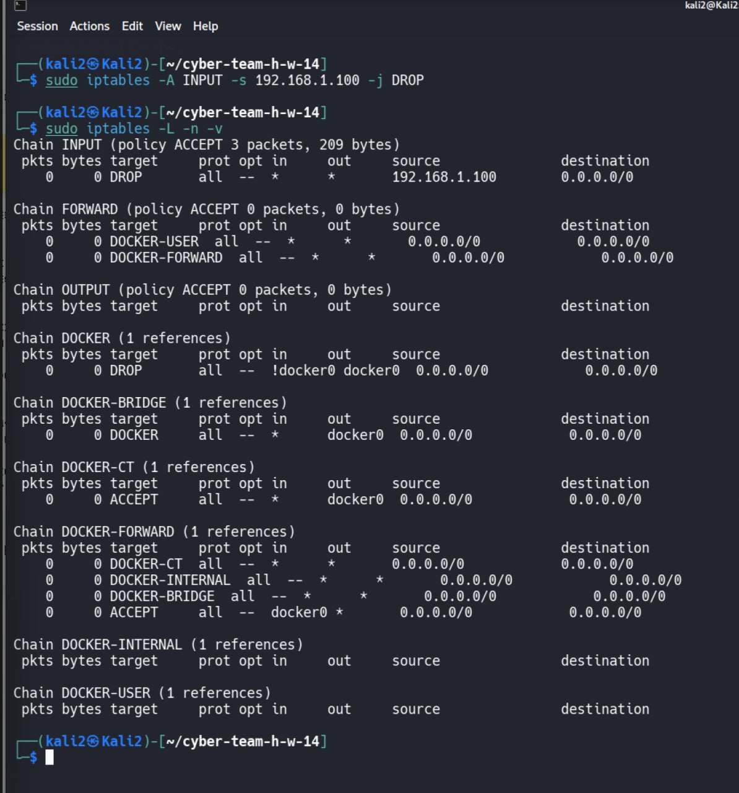
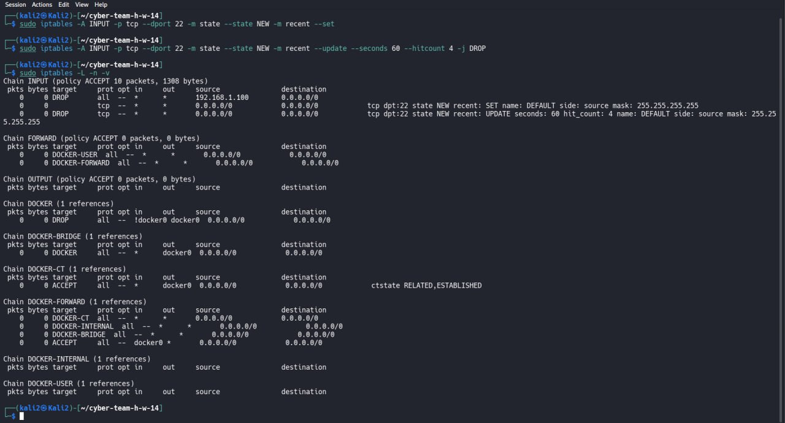
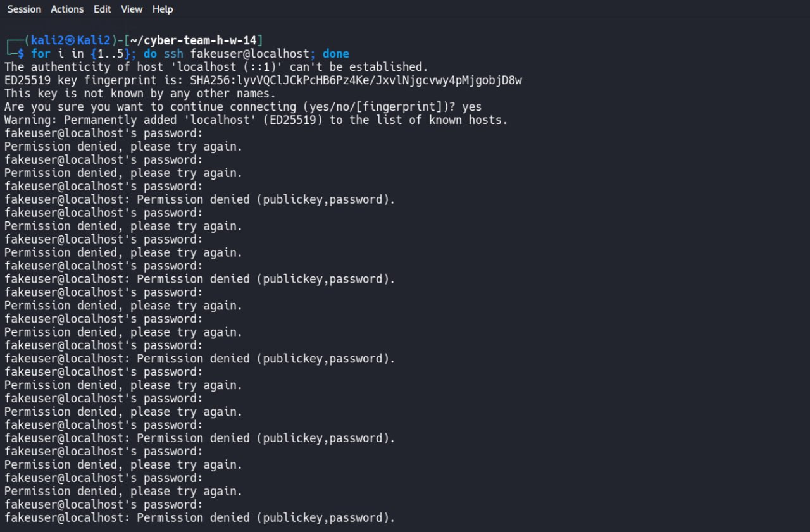
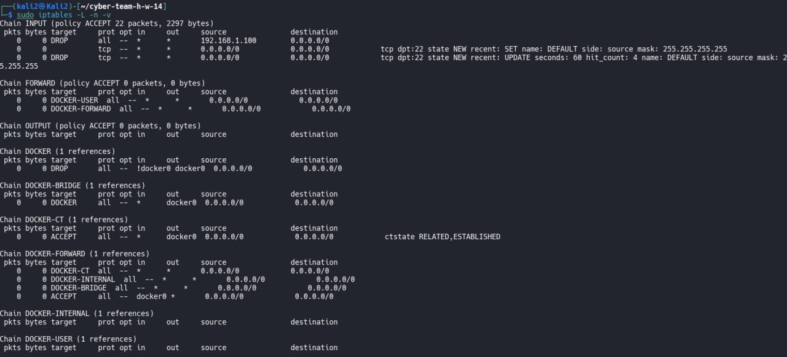
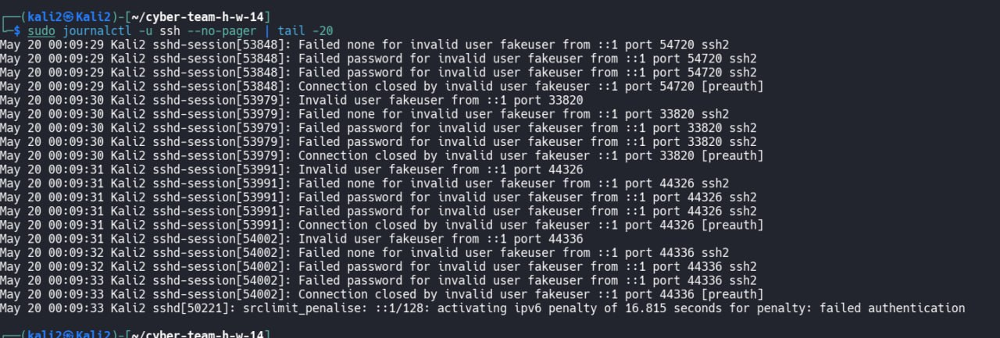

# Task 4 — Настройка iptables для защиты SSH

## Цель работы

В данной работе была выполнена настройка firewall с помощью iptables для:

- блокировки конкретного IP-адреса;
- ограничения частоты новых SSH-подключений;
- защиты от brute-force атак;
- анализа логов SSH;
- проверки работы firewall правил.

---

# Используемые инструменты

| Инструмент | Назначение |
|---|---|
| iptables | Настройка firewall |
| SSH | Тестирование подключений |
| journalctl | Анализ логов SSH |
| systemctl | Управление SSH service |
| ip a | Проверка сетевых интерфейсов |

---

# Проверка состояния SSH

Сначала была выполнена проверка статуса SSH сервиса.

Команда:

```bash
sudo systemctl status ssh --no-pager
```

На скриншоте видно, что SSH сервис был выключен.

После этого SSH был включён и запущен.

Команды:

```bash
sudo systemctl enable ssh
sudo systemctl start ssh
```

Далее была выполнена проверка сетевых интерфейсов.

Команда:

```bash
ip a
```

Скриншот:



---

# Проверка текущих правил iptables

Перед настройкой firewall была выполнена проверка существующих правил.

Команда:

```bash
sudo iptables -L -n -v
```

На момент начала работы активных INPUT правил не было.

Скриншот:



---

# Блокировка конкретного IP-адреса

Для выполнения требования задания был заблокирован IP-адрес:

```text
192.168.1.100
```

Команда:

```bash
sudo iptables -A INPUT -s 192.168.1.100 -j DROP
```

Проверка правил:

```bash
sudo iptables -L -n -v
```

На скриншоте видно правило DROP для указанного IP.

Скриншот:



---

# Настройка ограничения новых SSH-подключений

Далее была настроена защита SSH от brute-force атак.

---

## Первое правило — отслеживание новых подключений

Команда:

```bash
sudo iptables -A INPUT -p tcp --dport 22 -m state --state NEW -m recent --set
```

Что делает команда:

- отслеживает новые SSH подключения;
- записывает IP адрес источника;
- сохраняет историю подключений.

---

## Второе правило — блокировка частых подключений

Команда:

```bash
sudo iptables -A INPUT -p tcp --dport 22 -m state --state NEW -m recent --update --seconds 60 --hitcount 4 -j DROP
```

Что делает команда:

- проверяет количество новых SSH подключений;
- если за 60 секунд было более 4 попыток;
- firewall блокирует дальнейшие подключения.

---

# Проверка правил firewall

После настройки была выполнена проверка правил.

Команда:

```bash
sudo iptables -L -n -v
```

На скриншоте видно:

- DROP правило для IP;
- recent module;
- hitcount;
- ограничение SSH подключений.

Скриншот:



---

# Симуляция brute-force атаки

Для проверки защиты была выполнена серия неудачных SSH подключений.

Команда:

```bash
for i in {1..5}; do ssh fakeuser@localhost; done
```

Во время подключения вводился неправильный пароль.

На скриншоте видно сообщение:

```text
Permission denied
```

что подтверждает неудачные попытки авторизации.

Скриншот:



---

# Проверка срабатывания firewall

После серии попыток была выполнена повторная проверка iptables.

Команда:

```bash
sudo iptables -L -n -v
```

На скриншоте видно:

```text
hit_count: 4
```

Это подтверждает, что firewall начал отслеживать и ограничивать SSH подключения.

Скриншот:



---

# Анализ SSH логов

Для анализа событий SSH были просмотрены системные логи.

Команда:

```bash
sudo journalctl -u ssh --no-pager | tail -20
```

В логах видно:

```text
Failed password for invalid user fakeuser
```

Также видно:

```text
Connection closed by invalid user
```

и:

```text
srclimit_penalise
```

Это подтверждает:

- фиксацию failed authentication;
- обнаружение brute-force активности;
- работу механизмов ограничения SSH.

Скриншот:



---

# Результат

В ходе работы была успешно выполнена настройка firewall для защиты SSH.

Было реализовано:

- блокирование конкретного IP адреса;
- ограничение количества новых SSH подключений;
- защита от brute-force атак;
- журналирование SSH событий;
- анализ системных логов.

---
