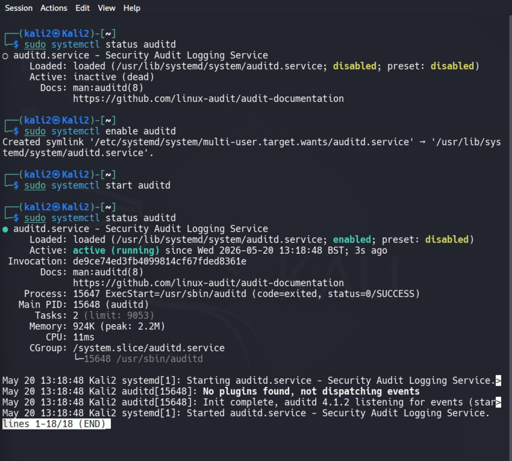
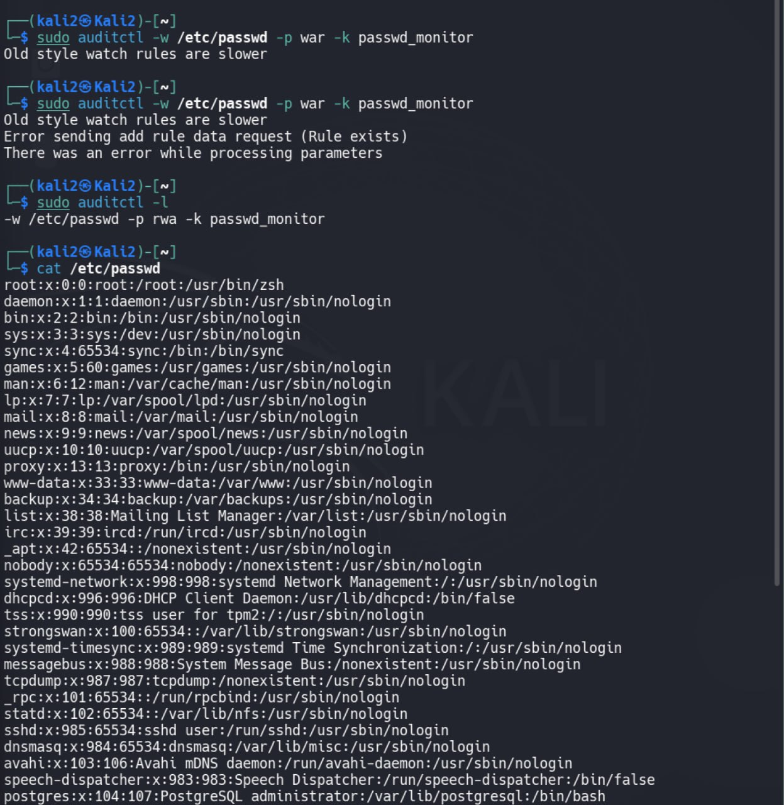
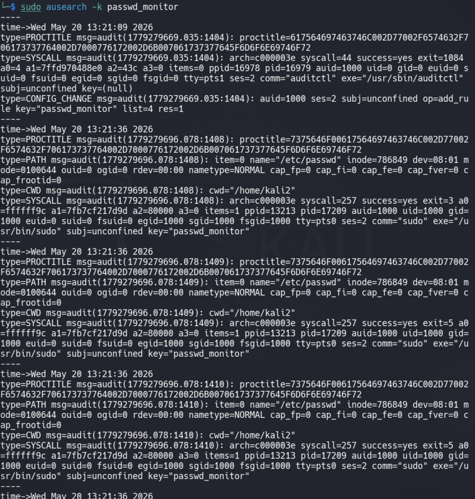

# Task 5 — Настройка аудита доступа к критичным системным файлам с помощью auditd

## Цель работы

В данной работе была выполнена настройка системы аудита Linux для мониторинга доступа к критичным системным файлам.

Было реализовано:

- включение службы auditd;
- настройка audit rules;
- мониторинг обращений к системному файлу;
- журналирование событий доступа;
- forensic-анализ действий пользователя;
- просмотр audit logs.

---

# Используемые инструменты

| Инструмент | Назначение |
|---|---|
| auditd | Система аудита Linux |
| auditctl | Управление audit rules |
| ausearch | Поиск audit событий |
| systemctl | Управление сервисами |
| journalctl | Просмотр системных логов |
| cat | Генерация события чтения файла |

---

# Что такое auditd

Auditd (Linux Audit Daemon) — подсистема Linux для журналирования действий в системе.

Auditd позволяет:

- отслеживать доступ к файлам;
- фиксировать запуск процессов;
- логировать действия пользователей;
- анализировать изменения системы;
- проводить forensic investigation после инцидентов.

---

# Проверка состояния auditd

Сначала была выполнена проверка состояния auditd сервиса.

Команда:
sudo systemctl status auditd

На момент начала работы сервис был выключен.

После этого auditd был включён и запущен.

Команды:
sudo systemctl enable auditd
sudo systemctl start auditd

Затем была выполнена повторная проверка статуса.

На скриншоте видно:
Active: active (running)

что подтверждает успешный запуск службы аудита.

Скриншот:

---

# Настройка audit rules

Для мониторинга системного файла /etc/passwd было создано audit правило.

Команда:
sudo auditctl -w /etc/passwd -p war -k passwd_monitor

---

# Разбор команды

| Параметр | Назначение |
|---|---|
| -w | monitor/watch file |
| /etc/passwd | файл для мониторинга |
| -p | permissions |
| w | write |
| a | attribute changes |
| r | read |
| -k passwd_monitor | ключ для поиска audit событий |

---

# Проверка audit rules

После настройки была выполнена проверка активных audit правил.

Команда:
sudo auditctl -l

На скриншоте видно правило:
-w /etc/passwd -p rwa -k passwd_monitor

Также видно предупреждение:
Old style watch rules are slower

Это означает, что используется старый формат watch rules, который работает медленнее современных syscall-based правил, однако полностью подходит для данной лабораторной работы.

Скриншот:

---

# Генерация событий доступа

Для создания audit событий был выполнен доступ к системному файлу /etc/passwd.

Команда:
cat /etc/passwd

Данная команда выполняет чтение системного файла, что вызывает генерацию audit event.

На скриншоте видно содержимое /etc/passwd.

Скриншот:

---

# Анализ audit logs

После генерации событий был выполнен анализ audit logs.

Команда:
sudo ausearch -k passwd_monitor

---

# Что показывает ausearch

В выводе audit logs отображается:

- время события;
- PID процесса;
- UID пользователя;
- syscall;
- путь к файлу;
- executable process;
- тип доступа;
- audit key.

---

# Анализ полученных событий

В логах были зафиксированы события:
type=PATH

что означает доступ к файлу.

Также были обнаружены:
name="/etc/passwd"

что подтверждает мониторинг нужного файла.

---

# Информация о пользователе

В логах присутствует:
uid=1000

что указывает на пользователя системы.

---

# Информация о процессе

Также видно:
exe="/usr/bin/sudo"

и:
comm="auditctl"

Это показывает, какой процесс выполнял действия в системе.

---

# Информация о времени события

Каждое событие содержит timestamp:
time->Wed May 20

что позволяет проводить forensic timeline analysis.

---

# Скриншот audit logs

Скриншот:

---

# Результат

В ходе работы была успешно выполнена настройка системы аудита Linux.

Было реализовано:

- включение auditd;
- настройка мониторинга системного файла;
- фиксация событий доступа;
- анализ audit logs;
- forensic monitoring действий пользователя.

---

# Вывод

В данной работе были изучены механизмы Linux auditing и forensic logging.

С помощью auditd была реализована система контроля доступа к критичным файлам.

Практическая работа показала, как Linux может:

- отслеживать действия пользователей;
- фиксировать обращения к файлам;
- сохранять forensic evidence;
- обеспечивать последующий анализ инцидентов безопасности.

Данный механизм широко используется в:

- SOC environments;
- DFIR (Digital Forensics and Incident Response);
- SIEM monitoring;
- Linux hardening;
- compliance auditing.
